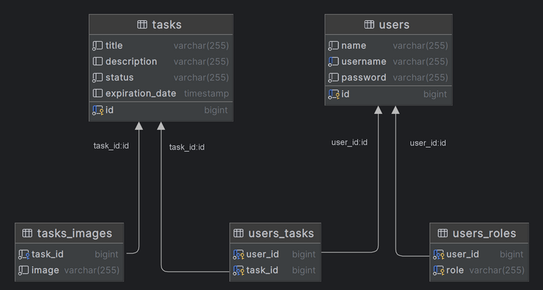
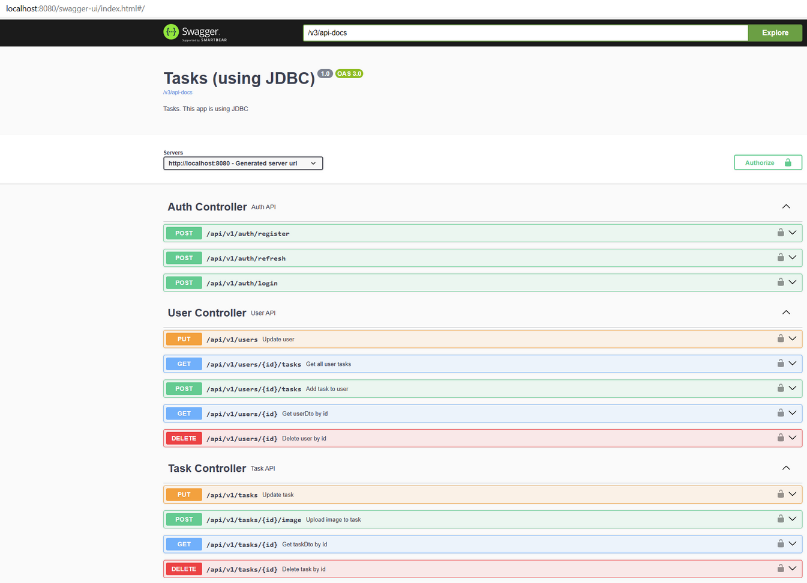

# Tasks (using JDBC)

This web application on REST API  helps manage user tasks\
The JWT is used to authorize the user\
You can attach files to tasks\
Redis is used as a cache requests

Class diagram

### <u>Run guide:</u>

To build the project: *.\mvnw clean package*\
To execute the app: *docker-compose up -d*\
To see all available endpoints, type in your browser\
http://localhost:8080/swagger-ui/index.html

To see all upload files, type in your browser (login and password: minioadmin)\
http://localhost:9090/

#### Log in 

via <u>admin</u>:
* login: ii@mail.ru
* password: 123

via <u>user</u>:
* login: pp@mail.ru
* password: 123

#### Example file <u>.env</u>:
POSTGRES_HOST=db\
POSTGRES_DB=tasks\
POSTGRES_SCHEMA=tasklist\
POSTGRES_USER=postgres\
POSTGRES_PASSWORD=post\
REDIS_HOST=redis\
REDIS_PASSWORD=$2a$12$0w9kCUz4Hdvisggz3K.7E.yxX.cmDiL/YyMRPUz5NsyjplE92hKL6\
JWT_SECRET=aGZiYmtiYWllYmNpZWFpZWJsZWNldWNlY2xhZWNhaWJlbGNhZWN3Q0VCV0VXSUM=\
MINIO_BUCKET=images\
MINIO_URL=http://minio:9000\
MINIO_ACCESS_KEY=minioadmin\
MINIO_SECRET_KEY=minioadmin

### <u>Technology stack:</u>

* Java: JDK 17
* Framework: Spring boot 3 (web, jdbc, validation, security, data-redis)
* Build: Maven
* API DB access: JDBC
* DB: Postgres, Redis
* Web server: Apache Tomcat
* Mapping: Mapstruct
* Library: Lombok
* Swagger: Springdoc-openapi
* Migrations: Liquibase
* Containers: Docker, docker-compose
* Tests: JUnit 5, Mockito
* and probably something else...

Application view

---

